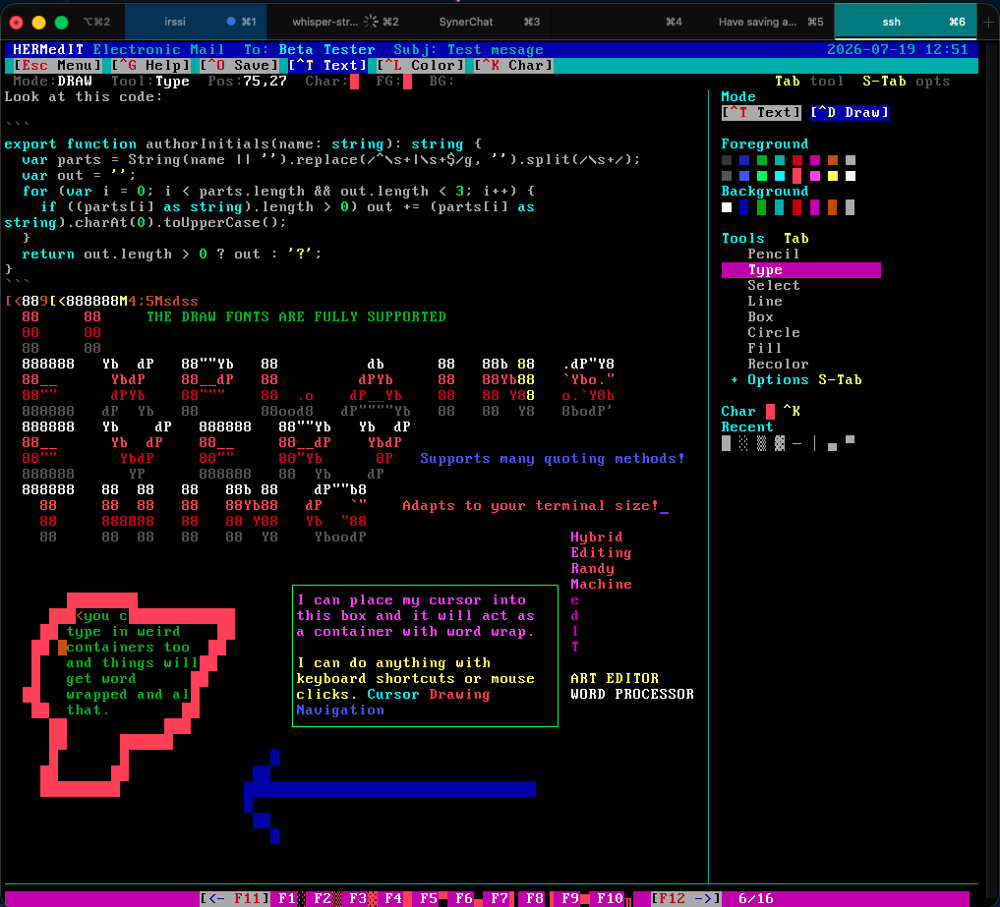
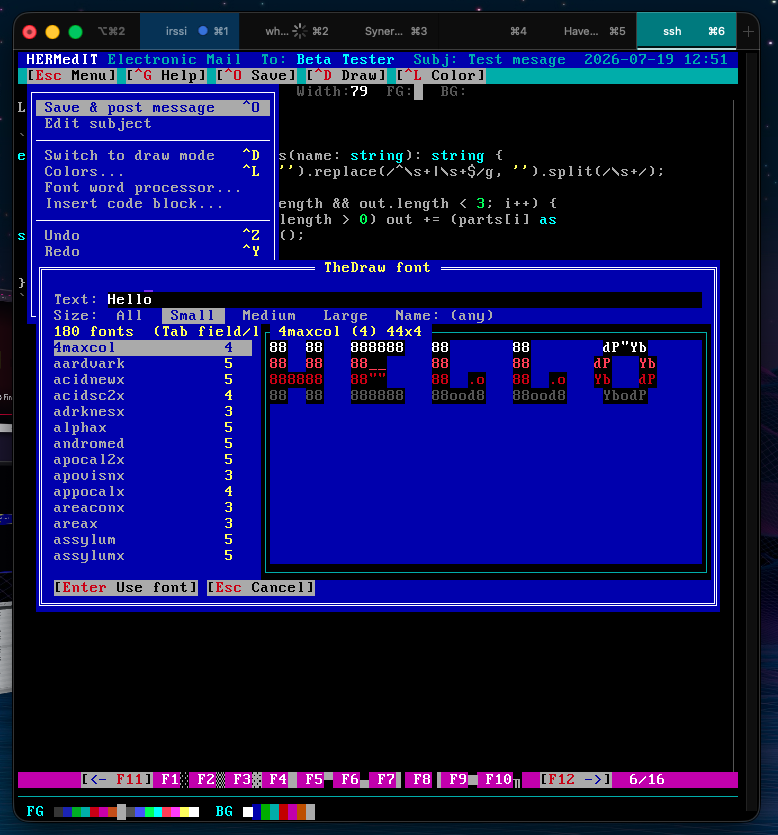
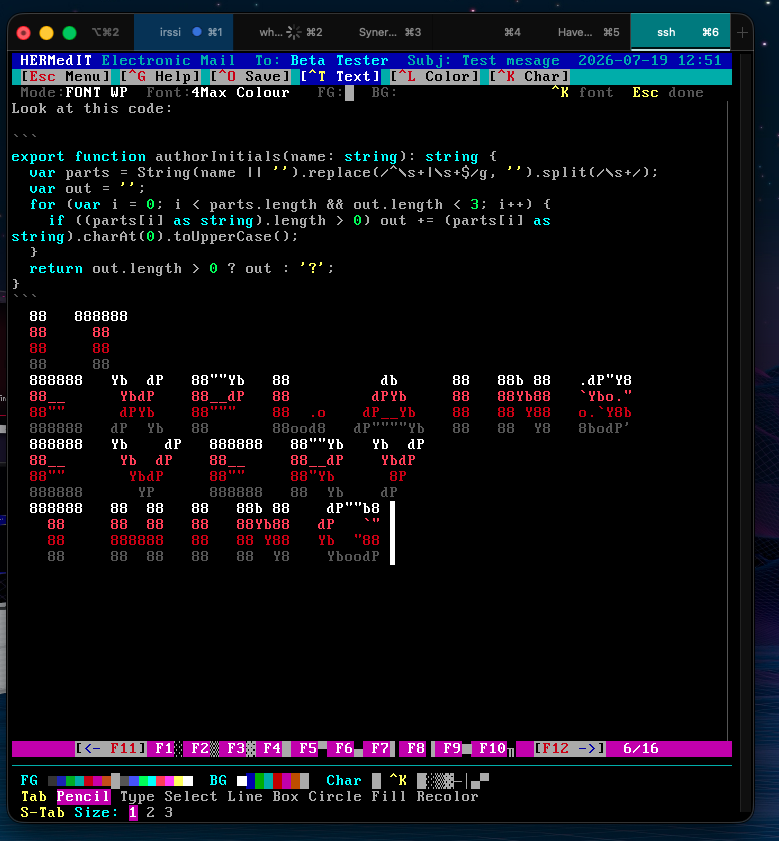
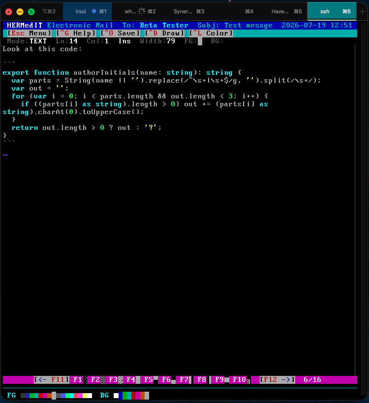
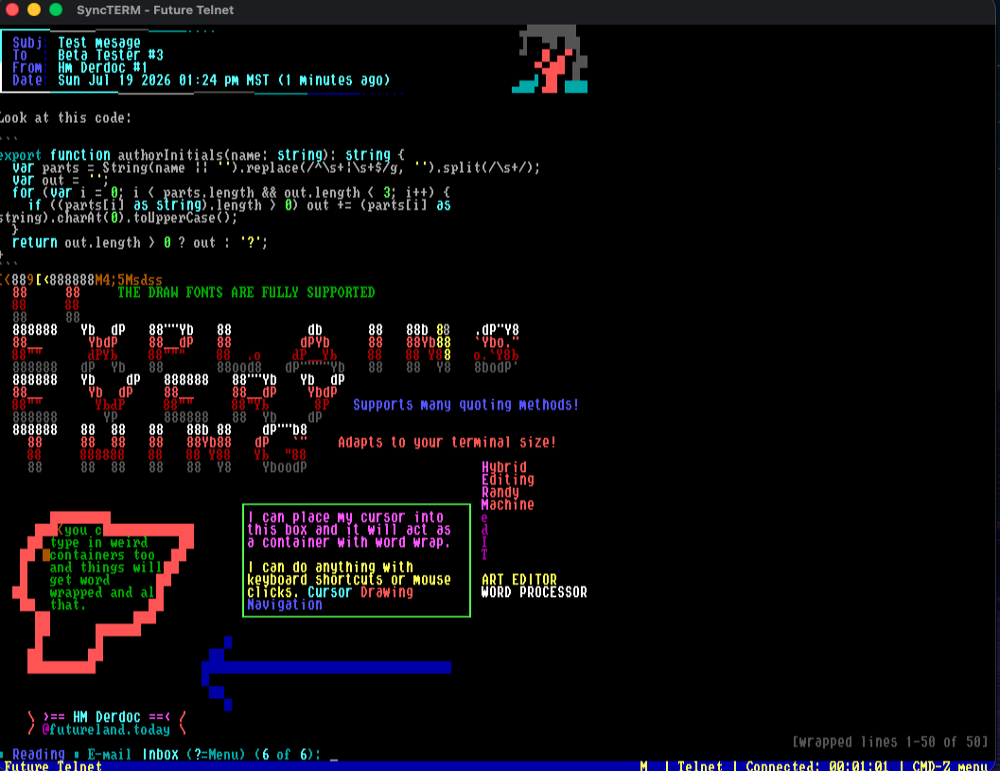
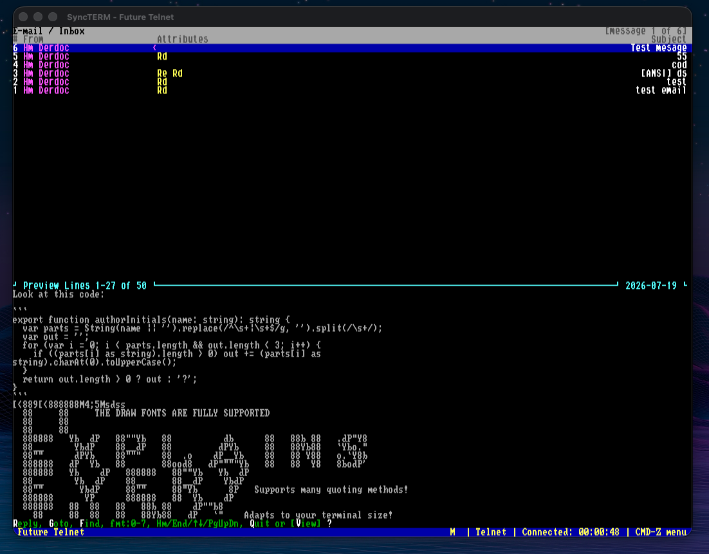

# HERMedIT

**A hybrid word processor / ANSI art studio / code editor for Synchronet BBS
messages** — one canvas where reflowing prose, fixed CP437 artwork, TheDraw
big-text fonts, and syntax-highlighted code coexist, driven equally by
keyboard and **real mouse events** in the terminal.



## What makes it different

### 1. An art editor with first-class mouse support

Terminal editors treat the mouse as an afterthought; HERMedIT parses SGR/X10
mouse reports directly and treats press, drag, and release as primary input.
Paint with drag strokes, drag out lines/boxes/circles/selections with live
preview, flood-fill on click, eyedrop with middle-click, click any button,
swatch, tool, or menu item, hover the dropdown menus, place the caret and
select text by mouse — with a complete keyboard path for every one of those,
so nothing requires the mouse either. Fixed art cells never move when prose
reflows; prose never overwrites art. Draw a box, click inside it, and it
becomes a **text container** that word-wraps within its walls. The F-key
character bar carries the TheDraw/PabloDraw/Moebius drawing convention
(16 sets, `F1`–`F10` type, `F11`/`F12` cycle).

### 2. TheDraw fonts as live type, not clip-art

~1071 bundled `.tdf` fonts with a size/name-filtered picker and live W×H
preview — and beyond one-shot stamping, a **font word processor**: type
through the font, word-wrap at the screen edge, edit with full caret
movement, and **switch fonts mid-string** (`^K`) like changing typeface in a
real word processor — mixed sizes share a baseline and reflow as one block.




### 3. Code blocks with live syntax highlighting

Markdown-style ``` fences right in the message body: tag the language
(```js) or let a bare fence **auto-detect** it — JavaScript, TypeScript,
Python, C++, Pascal — and the block re-highlights on every keystroke.
Fences are plain text (no box around your code), so readers copy/paste it
cleanly, and a fenced message never auto-selects the ANSI-art output format
that would break that.



### The baseline: a normal word processor

Underneath it all is a conventional message editor — paragraph editing with
word wrap, per-character color, undo/redo, mode-aware copy/cut/paste, reply
quoting with BBS conventions, and a responsive layout that adapts live to
terminal resizes (side panel on wide terminals, stacked controls on 80
columns).

### The output is just a message

Everything flattens to a normal Synchronet message — colors ride Ctrl-A
codes (or optional `[ANSI]` art format) — so **any stock reader shows the
result faithfully**, no special client needed:




---

Written in TypeScript, compiled to ES5 for Synchronet's SpiderMonkey 1.8.5
engine, and registered as an external message editor.

**Synchronet only, by design.** Multi-platform support (Mystic etc.) was
evaluated in [RESEARCH.md](RESEARCH.md) and rejected as a maintainability
burden. The host boundary is still kept narrow (`src/host/`) so the core
stays testable.

## Full feature rundown

- full Synchronet lifecycle: `%f` body path, `MSGINF`/`EDITOR.INF`,
  `QUOTES.TXT`, `RESULT.ED`, save = exit 0 / abort = exit 1, terminal-state
  restore on every exit path including disconnect;
- paragraph text editing with word wrap, hard-CR vs soft-wrap distinction,
  insert/overwrite, per-character color, undo/redo;
- Draw mode: fixed CP437 art cells painted with mouse (press/drag/release)
  or keyboard; art never moves when prose reflows, prose never overwrites art;
- Draw tools (Tab cycles; live preview): **Pencil**, **Type**, **Line**
  (axis-aligned runs auto-use CP437 `─`/`│`), **Box** (CP437 box-drawing),
  **Circle**, **Fill** (flood fill), and **Recolor**. Two-point tools drag from
  start to end, or set the start with Space and commit with Space; undo reverts
  a whole shape at once;
- the **Recolor** tool is an ink brush: drag over existing glyphs to repaint
  their color while keeping the character — channel-selectable FG only, BG
  only, or both (keys 1/2/3 or the menu, shown in the status bar);
- **copy / cut / paste** (`^C`/`^X`/`^V`), mode-aware: in Draw the **Select**
  tool marks a rectangular art region and paste lands at the cursor
  immediately (one undo step — no placement mode); in Text a mouse-drag
  selects a string (paste inserts at the caret);
- **reply quoting** (`^R`) with BBS conventions: pick lines, choose a style
  (`> ` standard, ` AB> ` initials, or plain) and an optional
  "<author> wrote:" attribution, formatted and wrapped on insert;
- **TheDraw font text** — two modes, both from ~1071 bundled `.tdf` fonts, via
  a picker that filters by size (←→) and name with a live preview showing the
  rendered W×H:
  - **Font text (stamp)** — render a fixed string; the block follows the cursor
    and click/Enter stamps it (one undo step);
  - **Font word processor** — pick a font and type *live*: the block anchors
    where you start, word-wraps at the screen edge, and scrolls to keep your
    typing in view. Full editing with a blinking font-height cursor; the mouse
    is a text cursor (click to place the caret), arrows/Home/End move, Enter is
    a new line, Tab is a 2-space indent, Esc stamps or discards. `^K` switches
    fonts mid-string like a regular word processor: existing text keeps its
    font, following text uses the new one, and the mix wraps as one cohesive
    block (lines grow to their tallest font; smaller glyphs sit on the shared
    baseline). Moving the caret re-adopts the surrounding font, and the menu
    offers the word processor from both Text and Draw modes. Fonts + a
    prebuilt index live in `fonts/` (see below);
- **Code blocks with live syntax highlighting** — markdown-style ``` fences
  in the message body: a line of ``` opens a block (```js tags the language;
  a bare fence auto-detects it from the content), the next ``` closes it.
  Menu → "Insert code block..." types the fence pair for you and puts the
  caret between them. Highlighting re-runs on every keystroke — JavaScript,
  TypeScript, Python, C++, Pascal, or Plain — and the colors ride the normal
  Ctrl-A flatten, so readers see them in any BBS reader. Deliberately NOT a
  CP437 box: fences are plain text, so readers can copy/paste the code; the
  dim fence lines are the block's horizontal dividers, long lines wrap
  rather than truncate, and a fenced message never auto-selects the ANSI-art
  save format (which would break copy/paste flow — the save dialog can still
  force it). Arrowing past any box's top/bottom edge walks out of it — boxes
  never trap the caret. Engine: `src/core/syntax.ts`.
- the **Type** tool is free-form positional text for art: click anywhere and
  type, and characters land as fixed art cells (no wrap, no reflow) with
  typewriter behavior — Enter carriage-returns to the column you started at,
  Backspace retreats and erases. This is the text-artist path (the way ANSI
  editors place text), distinct from Text mode's reflowing prose flows;
- box-constrained text regions with independent text per area: draw a box,
  switch to text mode, and click inside it — typing is confined to the box's
  interior (wraps at the right wall, continuation lines start at the left
  wall) and the border glyphs never move. Each box owns its own text and the
  full-width body owns its own; clicking between them switches which you edit,
  and every area keeps its content (a box masks the body beneath it). Draw
  several boxes and type in each. The menu's "Leave text box" (or clicking
  outside any box) returns to the body;
- GUI-style chrome: labeled buttons that always show their key equivalents,
  dropdown menu, modal dialogs (help, save/abort confirm, glyph picker,
  color picker, quote picker, subject prompt), clear dividers between the
  tool areas and the canvas;
- adaptive layout: uses the full terminal; at >= 100 columns a side tool
  panel appears; the 79-column message-safe boundary is always marked;
- CP437 and UTF-8 sessions with byte-exact codecs; Ctrl-A colors only in
  posted bodies (never raw ANSI);
- direct SGR/X10 mouse parsing with coordinate hit-testing (no per-cell
  hotspots); complete keyboard-only fallback.

Free-form text placement is covered by the Draw-mode Type tool (as fixed art);
Text mode covers reflowing prose in the body and boxes. Not yet implemented
(future slices): block selection + copy/paste, half-block shape fidelity,
re-editable/reflowable free-floating text *flows* (semantic, as opposed to the
Type tool's baked art), native project drafts, standalone ANSI/BIN/SAUCE
files. See [ROADMAP.md](ROADMAP.md).

## Layout

```text
row 1      title: subject / to / area
row 2      [Esc Menu] [^G Help] [^O Save] [^R Quote] [^D Draw] [^L Color] ...
row 3      status: Mode:TEXT  Ln:1  Col:1  Ins  Width:79  FG:█ BG:█   key hints
rows 4..   canvas (side panel adjacent on wide terms)
last-1     ──────────────────────────────────────────── divider
last       [<- F11] F1░ F2▒ F3▓ F4█ F5▀ F6▄ F7▌ F8▐ F9■ F10· [F12 ->]  6/16
```

The layout is responsive: the terminal size is polled every frame (Synchronet
tracks NAWS resize reports), so resizing the terminal re-lays-out the view
live. On terminals under 100 columns there is no room for the side panel;
in Draw mode its controls instead appear as a compact two-row block above
the character-set bar, flowed inline to spend horizontal space rather than
canvas rows:

```text
 FG ················  BG ········  Char █ ^K  █░▒▓─│▄▀
 Tab Pencil Type Select Line Box Circle Fill Recolor
```

Keys follow common editor muscle memory (buttons show the Ctrl combo):

| Save `^O` | Undo `^Z` | Text mode `^T` | Quote `^R` | Help `^G` |
| Abort `^A` | Redo `^Y` | Draw mode `^D` | Color `^L` | Char `^K` |

`^W` (or middle-click) is the eyedropper: it picks up the character + colors
of the cell under the cursor as your current ink, from any tool, without
switching tools or taking UI space. `Esc` opens the menu; `^C`/`^X`/`^V`
copy/cut/paste.

`F1`-`F10` type CP437 characters from the character-set bar — the TheDraw /
PabloDraw / Moebius drawing convention (16 stock sets: boxes, blocks, arrows,
accents...). `F11`/`F12` or the clickable `◄ ►` arrows cycle sets; Moebius's
`Ctrl+,` / `Ctrl+.` / `Ctrl+/` (prev / next / default) also work on terminals
that transmit them (CSI-u or xterm modifyOtherKeys — most BBS terminals
cannot, which is why the F11/F12 and mouse paths exist).

Every command key dodges three collision classes so it works on **every**
client, not just forgiving ones: XON/XOFF flow control (`^S`/`^Q`), cursor
navigation (`^B ^E ^F ^N ^P ^V` and arrows), and structural keys (`^H` BS,
`^I` Tab, `^M` Enter, `^[` Esc). That is why Save is `^O` (nano "write Out",
not `^S`/`^P`), Abort is `^A` (not `^E`/`^Q`), and Help is `^G` (not `^H`).
For muscle memory, `^S` and `^Q` are still accepted as secondary Save/Abort
aliases where flow control permits — but `^O`/`^A` and the menu are the
guaranteed paths.

Planned features (selection + copy/paste, fill, and box/circle/line shape
tools) are tracked in [ROADMAP.md](ROADMAP.md).

## Building

Requires Node (for the toolchain only — the output runs on Synchronet):

```sh
cd /sbbs/repo/xtrn/future_edit
npm install
npm run check     # typecheck + vitest (201 tests) + jsexec smoke test
npm run build     # emits ./future_edit.js (the editor) and dist/smoke_runner.js
```

The two-step build (tsc lowers to ES5, esbuild bundles with an es5 tripwire)
is the same proven pipeline as `/sbbs/mods/fshell_ts`.

### Bundled fonts

`fonts/tdf/*.tdf` are the ~1071 TheDraw fonts (copied from `ctrl/tdfonts/`);
`fonts/tdfont_map.json` is the height map; `fonts/tdfont_index.json` is the
prebuilt `{name,height,type}` index the picker reads (built by
`node scripts/build-font-index.mjs`, re-run if the font set changes). The
editor reads these from `<editor dir>/fonts/` at runtime, so it is
self-contained.

## Installing on your Synchronet BBS

Nothing exotic here — HERMedIT installs like any Synchronet external message
editor. The repo ships the prebuilt bundle (`future_edit.js`), so **Node is
only needed if you want to modify and rebuild**, not to run it.

1. **Get the files onto the board.** Any path works;
   `/sbbs/xtrn/hermedit` is conventional:

   ```sh
   git clone https://github.com/hmderdoc/HERMedIT.git /sbbs/xtrn/hermedit
   ```

2. **Register the editor.** Either through SCFG (`External Programs ->
   External Editors`) or by adding a section to `ctrl/xtrn.ini` (adjust the
   `cmd` path to where you cloned):

   ```ini
   [editor:HERMEDIT]
       name=HERMedIT (text + ANSI art)
       cmd=?/sbbs/xtrn/hermedit/future_edit.js %f
       settings=0xe02c00
       ars=ANSI AND COLS 80
       type=0
       soft_cr=3
       quotewrap_cols=0
   ```

   `settings` = `QUICKBBS | EXPANDLF | QUOTENONE | QUOTEWRAP | SAVECOLUMNS |
   XTRN_UTF8` (0xe02c00): QuickBBS-style `MSGINF` (declares the session
   charset on line 8), terminal-width metadata saved, UTF-8 sessions
   allowed. `QUOTENONE` (not `QUOTEALL`) so a reply starts with a clean
   body — the original message stays in `QUOTES.TXT` and is inserted
   explicitly through the quote picker, never as a surprise pre-fill.
   `KEEP_CTRL_A` is deliberately off so quote text arrives color-stripped.
   `soft_cr=3` (retain) because byte 0x8d is a valid CP437 art glyph.

3. **Recycle the terminal server** (or wait for a config reload) so the new
   `xtrn.ini` section is picked up.

4. **Select it**: users pick the editor in their user settings / defaults
   menu; sysops can also set it per-user in uedit.

**Updating**: `git pull` in the install dir — the script is compiled fresh
on every editor launch, so no recycle is needed for code updates (only for
`xtrn.ini` changes). **Rolling back**: remove or comment out the
`[editor:HERMEDIT]` section (keep a backup copy of `xtrn.ini` before
editing, as with any config change) and recycle; users who had selected it
fall back to the system default editor.

## Testing

- `npm test` — 201 vitest unit tests over the document model (wrap/reflow,
  art fixity, undo, box-constrained regions), Ctrl-A/CP437/UTF-8 codecs,
  drop-file parsers, and the diff renderer.
- `npm run smoke` — runs the pure core on the real SpiderMonkey engine via
  `jsexec`.
- Manual acceptance cases live in the compliance matrix of
  [SYNCHRONET_CONTRACT.md](SYNCHRONET_CONTRACT.md).

## Planning documents

| Artifact | Purpose |
| --- | --- |
| [RESEARCH.md](RESEARCH.md) | Findings from Synchronet, FSEditor, SlyEdit, the resource editor, and textmode formats |
| [SYNCHRONET_CONTRACT.md](SYNCHRONET_CONTRACT.md) | Launch, drop-file, result-file, text, color, and encoding contract |
| [DESIGN.md](DESIGN.md) | Document model, editing modes, UI, adapters, codec boundaries |
| [PLAN.md](PLAN.md) | Gated implementation plan and future slices |
| [HANDOFF.md](HANDOFF.md) | Resume point for another session |

Design deviations from the draft docs, decided for v1 with the sysop:
GUI-style persistent button chrome instead of purely contextual overlays;
art cells anchor to absolute document rows; a single text region (one active
box) rather than the full multi-region model — the message flow reflows into
whichever box you click into, or the full width when you leave it; no native
project format yet — the flattened message is the only output.
